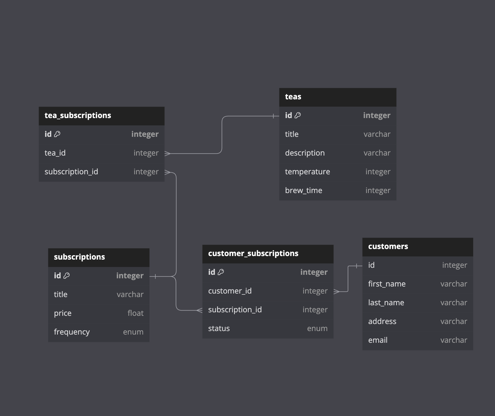

# Tea Subscription API
This API is built for a tea subscription service that requires 3 endpoints:
- An endpoint to subscribe a customer to a tea subscription
- An endpoint to cancel a customer's tea subscription
- An endpoint to see all of a customer's subscription (active and cancelled)

## Setup

### Prerequisites
- Ruby (version >= 3.2.2)
- Rails (version >= 7.1.3.2)
- PostgreSQL

### Installation
1. Clone the repository:

    ```bash
    git clone <repository_url>
    ```

2. Install dependencies:

    ```bash
    bundle install
    ```

3. Set up the database:

    ```bash
    rails db:{drop,create,migrate,seed}
    ```

## Usage
- Start the server:

    ```bash
    rails server
    ```
## Database Set Up


## RESTful Endpoints
```
GET /api/v0/customers/:customer_id/subscriptions

{
  "data": {
    "type": "customer_subscription",
    "id": 1,
    "attributes": {
      status: "Active",
      start_date: "06/11/2022"
    }
  }
}
```
- Retrieve all Subscriptions for a Customer
- Customer ID is passed in through parameters
```
POST /api/v0/customer_subscriptions
```
- Create a new CustomerSubscription order
- Customer ID and Subscription ID must be passed in the body
```
PATCH /api/v0/customer_subscriptions/:customer_subscription_id

"data": [{
  "type": "subscription",
  "id": "1",
  "attributes": {
    "title": "Blend Box",
    "price": "30",
    "frequency": "2"
  }
}]
```
- Update a CustomerSubscription order
- CustomerSubscription ID must be passed in the parameter
